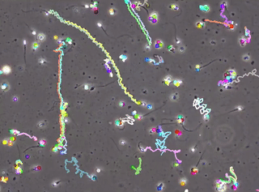

# MotilitAI

<p align="center">
 
</p>

With **motilitAI**, human semen samples from the  can be automatically assessed in respect to sperm motility. Several regression models are trained to
automatically predict the percentage (0 to 100) of progressive, non-progressive, and immotile spermatozoa in a given sample. The videos are adopted for unsupervised tracking and two different feature extraction methods, in particular custom movement statistics (cms) and mean squared displacement features (msd). We train Support Vector Regressors (SVR), Multilayer Perceptron (MLP) models, Convolutional Neural Networks (CNNs), and Recurrent Neural Networks (RNNs) on the extracted features. Best results are achieved using a linear SVR on an aggregated and quantised representation of individual displacement features of each sperm cell.

## Citing
If you use **motilitAI** in your research work, you are kindly asked to acknowledge the use of **motilitAI** in your publications.
> S. Ottl, S. Amiriparian, M. Gerczuk and B. Schuller, "A Machine Learning Framework for Automatic Prediction of Human Semen Motility", 2021. [https://arxiv.org/abs/2109.08049](https://arxiv.org/abs/2109.08049)

```
@article{ottl2021machine,
  title={A Machine Learning Framework for Automatic Prediction of Human Semen Motility},
  author={Ottl, Sandra and Amiriparian, Shahin and Gerczuk, Maurice and Schuller, Björn},
  journal={arXiv preprint arXiv:2109.08049},
  year={2021}
}

```

## Installation

Create a virtual environment, e.g. with conda:
```bash
conda create -n optical-flow-visem
conda activate optical-flow-visem
```

### Dependencies
There is an `environment.yml` file with all dependencies.

## Usage

### Prediction Models
There are two Machine Learning approaches, one using ensemble mean squared displacement (emsd) features to train different models, and one with Bags-of-Words (BoWs) created from either custom movement statistics (cms) or individual mean squared displacement (imsd) features.
```
python models/[emsd|bow]-prediction-models.py <features_fold_1> <features_fold_2> <features_fold_3> <additional options>
```

#### Shared CLI options

| Variable                  | Type                         | Description                          | Required | Default value |
|---------------------------|------------------------------|--------------------------------------|----------|---------------|
| -md, --model-dir | string | Model directory. | false | model |
| -ri, --random-iterations | int | Number of random grid serach iterations. | false | 10 |

#### Specific CLI options for motility prediction with emsd features

| Variable                  | Type                         | Description                          | Required | Default value |
|---------------------------|------------------------------|--------------------------------------|----------|---------------|
| -ma, --model-architecture | choices=[svr, mlp, cnn, rnn] | Type of neural network architecture. | false | cnn |
| -sd, --semen-data | string | Path to semen_data_analysis csv file. | false | sement_data_analysis.csv |

#### Specific CLI options for motility prediction with BoWs

| Variable                  | Type                         | Description                          | Required | Default value |
|---------------------------|------------------------------|--------------------------------------|----------|---------------|
| -bd, --bow-dirname | string | BoW directory name. | true |  |
| -ma, --model-architecture | choices=[svr, mlp] | Type of neural network architecture. | false | mlp |
| -s, --sizes | int | Sizes for BoW. | 1+ | [2500, 5000] |
| -a, --assignment-vectors | int | Number of assigned codebook vectors. | 1+ | [50] |
| -sn, --session-number | int | Starting session. | false | 0 |
